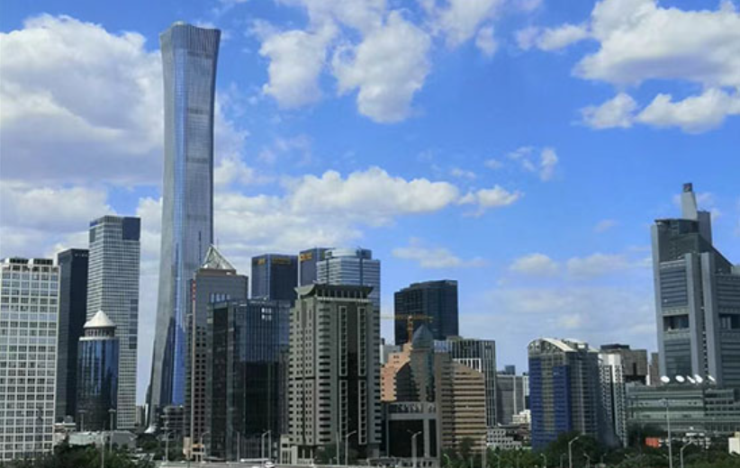
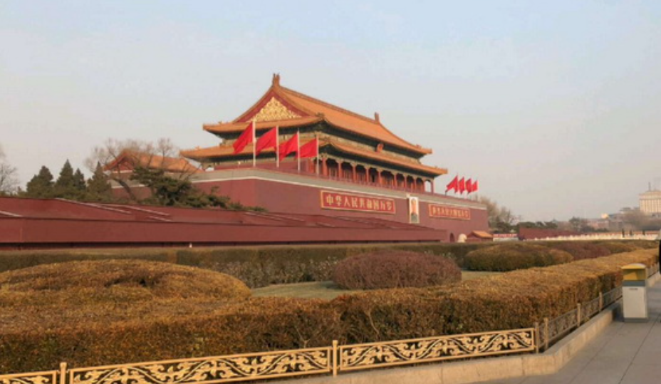
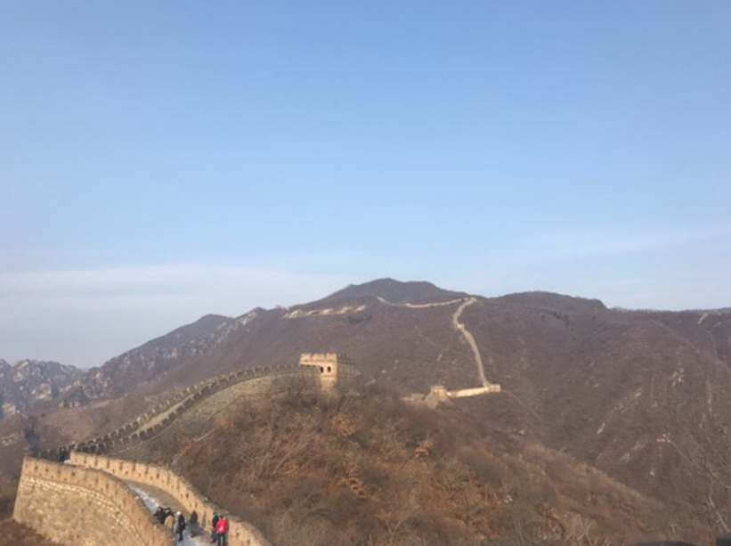
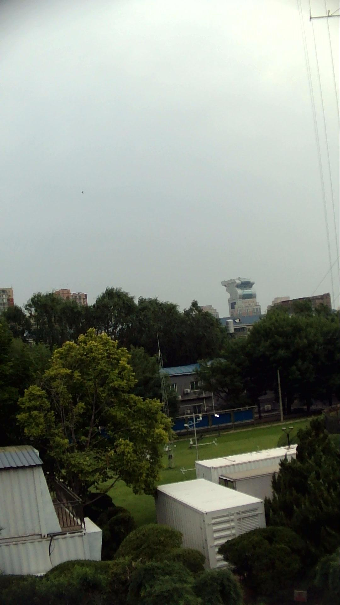
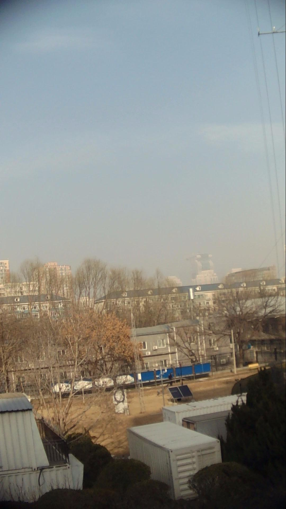

# PE-PM2.5

## Image-based PM2.5 Estimation From Imbalanced Data Distribution Using Prior-Enhanced Neural Networks

## Dependencies
Python 3.8
PyTorch 1.12.1
opencv-python 4.7.0.72

## Run

Put your test images in the folder 'imgs/', and then run the following scripts.

```shell
# change parameters in the test.py as you like
python test.py
```

## Checkpoints & Datasets

[Google](https://drive.google.com/drive/folders/1oE67ZCw2hnKZP_HewZEqq82bwNBchz3D?usp=drive_link)
Or
[Baidu](https://pan.baidu.com/s/1O_nMib7ljTl928aFQaee6A?pwd=k9vn)

## Useful links

[Image-based-PM2.5-Estimation](https://github.com/qing-xue/Image-based-PM2.5-Estimation)

[(ICONIP 2023)](https://link.springer.com/chapter/10.1007/978-981-99-8141-0_20) Prior-Enhanced Network for Image-based PM2.5 Estimation from Imbalanced Data Distribution

## Citing 

The code is free for academic/research purpose. Please kindly cite our work in your publications if it helps your research.  

```BibTeX
@article{fang2024image,
  title={Image-Based PM2.5 Estimation From Imbalanced Data Distribution Using Prior-Enhanced Neural Networks},
  author={Fang, Xueqing and Li, Zhan and Yuan, Bin and Chen, Yihang},
  journal={IEEE Sensors Journal},
  volume={24},
  number={4},
  pages={4677--4693},
  year={2024},
  publisher={IEEE}
  link={10.1109/JSEN.2023.3343080}
}
@inproceedings{fang2023prior,
  title={Prior-Enhanced Network for Image-Based PM2. 5 Estimation from Imbalanced Data Distribution},
  author={Fang, Xueqing and Li, Zhan and Yuan, Bin and Wang, Xinrui and Jiang, Zekai and Zeng, Jianliang and Chen, Qingliang},
  booktitle={International Conference on Neural Information Processing},
  pages={260--271},
  year={2023},
  organization={Springer}
}
```

## Example

<div align=center>
<center class="half">
    
    
</center>

|  Model   | img_1 (left)  |  img_2 (right)
|  ----  | ----  |  ----
| Ground Truth  | 20.00 |  73.00
| PE-ResNet18  | 23.16 |  64.03

<center class="half">
    
    
</center>

|  Model   | img_1 (left)  |  img_2 (right)
|  ----  | ----  |  ----
| Ground Truth  | 80.0 |  152.0
| PE-ResNet18  | 84.84 |  125.80

<center class="half">
    
    
</center>

|  Model   | img_1 (left)  |  img_2 (right)
|  ----  | ----  |  ----
| Ground Truth  | 22.0 |  186.0
| PE-ResNet18  | 25.85 |  184.47

</div>


[](https://badges.toozhao.com/stats/01F0MPA6GQQXGBJSVKT85C4PKT "Get your own page views count badge on badges.toozhao.com")
