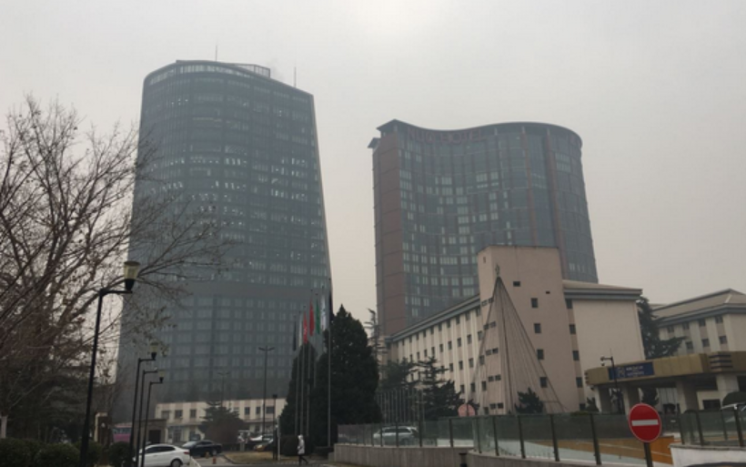

# PE-PM2.5

## Prior-Enhanced Network for Image-based PM2.5 Estimation from Imbalanced Data Distribution 

## Run

Put your test images in the folder 'imgs/', and then run the following scripts.

```shell
# change parameters in the test.py as you like
python test.py
```

## Checkpoints

[Google](https://drive.google.com/drive/folders/1oE67ZCw2hnKZP_HewZEqq82bwNBchz3D?usp=drive_link)
[baidu](https://pan.baidu.com/s/1O_nMib7ljTl928aFQaee6A?pwd=k9vn)

## Citing 

The code is free for academic/research purpose. Please kindly cite our work in your publications if it helps your research.  

```BibTeX
@article{
  title={Prior-Enhanced Network for Image-based PM2.5 Estimation from Imbalanced Data Distribution},
  author={Xueqing Fang, Zhan Li, Bin Yuan, Xinrui Wang, Zekai Jiang, Jianliang Zeng and Qingliang Chen},
  conference={The 30th International Conference on Neural Information Processing (ICONIP)},
  year={2023}
  link={DOI:xxx}
}
```


## Example

<div align=center>
<center class="half">
    
    
</center>

|  Model   | img_1 (left)  |  img_2 (right)
|  ----  | ----  |  ----
| Ground Truth  | 20.00 |  73.00
| PE-ResNet18  | 23.16 |  64.03

<center class="half">
    
    
</center>

|  Model   | img_1 (left)  |  img_2 (right)
|  ----  | ----  |  ----
| Ground Truth  | 80.0 |  152.0
| PE-ResNet18  | 84.84 |  125.80

<center class="half">
    
    
</center>

|  Model   | img_1 (left)  |  img_2 (right)
|  ----  | ----  |  ----
| Ground Truth  | 22.0 |  186.0
| PE-ResNet18  | 25.85 |  184.47

</div>


[](https://badges.toozhao.com/stats/01F0MPA6GQQXGBJSVKT85C4PKT "Get your own page views count badge on badges.toozhao.com")
